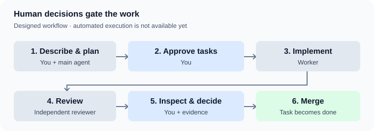

# theSystem · User manual

Build software with AI agents. Keep control of the requirements, permissions, and result.

> [!IMPORTANT]
> **Human-owned contract · draft awaiting review.** This manual is the highest authority for intended functionality: what the human wants and what AI must build. Publication does not mean every expectation is approved or implemented.

[Get started](#get-started) · [Projects](#register-a-project) · [Workflow](#from-request-to-completed-change) · [Status](#understand-status) · [Permissions](#set-agent-permissions) · [Learning](#review-evidence-and-learning) · [Open decisions](#open-decisions)

## What works today

| Capability | Availability |
| --- | --- |
| Installation, company command, project registration | Implemented |
| Shared planning skills and assisted memory/skill review | Implemented in Hermes; coverage and fallback are being verified |
| Experimental rules and skills | Opt-in with `--experimental` |
| Automated task admission, isolated execution, independent review, run records | **Partial local implementation; MVP incomplete** |
| Native Copilot operation, Herdr launch, upgrade/rollback/uninstall, wiki ingestion | **Partial local verification; MVP incomplete** |

“Implemented” describes repository capability, not a fresh deployment certification.

> [!WARNING]
> **The execution contract is not fully certified.** Local contained Hermes and Copilot runs, independent reviews, and two browser-tested apps are documented in [MVP evidence](docs/MVP-EVIDENCE.md). The third app and several installation/learning guarantees remain incomplete; the workflow below remains the intended contract, not a blanket availability claim.

## Get started

### 1. Install

Supported MVP targets are Linux x86-64 on Ubuntu LTS and Arch/Omarchy. Fresh installation must obtain missing prerequisites through supported paths; no preinstalled Hermes, uv, Copilot, or Herdr is assumed. Choose Hermes or Copilot as the agent runtime. A Copilot-only install and operation must not depend on Hermes. Human account sign-in remains a human step.

```bash
curl -fsSL https://raw.githubusercontent.com/juancrfig/theSystem/master/install | bash
```

1. Choose a workspace; the default is `~/workspace`.
2. Choose the name of the main command; the default is `company`. Use a single word with standard English characters.
3. For a new `master` profile, complete the Hermes setup wizard and choose **Blank Slate**. You own the provider and model choices.

**Success:** the installer reports `Ready` with the profile and workspace. An earlier error means installation is incomplete; some files may already exist.

The installer creates a distribution, **not a Git checkout**. It configures the dedicated `master` profile, shared skills, required CLI toolsets, and the memory-review environment. Your default Hermes profile is not configured. An existing `master` is reused, but theSystem's managed settings still apply.

> [!NOTE]
> **Current installer limitation:** Fresh local-distribution Copilot-only installation and blank installation passed in clean Ubuntu 24.04 and Arch base containers. Upgrade, rollback, and uninstall preserved company data in isolated local probes. Interactive desktop/account setup, Hermes normal install, remote-distribution install, and interrupted-install recovery are not yet certified. The intended lifecycle safely upgrades, rolls back installed software, and uninstalls without deleting company knowledge, source repositories, work records, or credentials. Rollback does not undo completed work.

<details>
<summary><strong>Installer options</strong></summary>

| Option | Effect |
| --- | --- |
| `--workspace PATH` | Choose the workspace. |
| `--company NAME` | Create the company command; refuses unrelated command-name collisions. |
| `--experimental` | Include experimental rules and skills. |
| `--blank=yes` | Install theSystem infrastructure only; no Herdr, Hermes, Copilot, or model setup. Verified locally on a clean Ubuntu container; other target coverage remains open. |
| `--non-interactive` | Requires `--company` and an existing `master`; cannot perform first-time setup. |
| `--help` | Show usage without installing. |

Example with explicit choices:

```bash
curl -fsSL https://raw.githubusercontent.com/juancrfig/theSystem/master/install | bash -s -- --workspace "$HOME/workspace" --company company --experimental
```

Shared skills are trusted for the workspace, and those needing curator protection are pinned. Concrete model selection remains yours.

</details>

### 2. Open your workspace

If you chose `company`:

```bash
company
```

**Intended success:** Herdr opens the selected agent in the command's bound workspace, regardless of your current directory. The command lives in `~/.local/bin`, which must be on your shell's `PATH`. If Herdr reports an interaction is pending, the agent is not yet ready.

Herdr manages the session display, not task execution or approval. Remote access stays off by default. Direct/no-Herdr and headless operation remain available. In blank mode, non-chat company operations work without an agent runtime; chat requires an explicitly selected installed runtime or reports none configured. Copilot launch in Herdr has a local isolated proof after the credential-safety correction; installed normal launch on both supported targets and Hermes-in-Herdr are not yet certified. Direct and headless paths have limited local probes in [MVP evidence](docs/MVP-EVIDENCE.md).

If you skipped the company command, open Hermes with `master` from the installed workspace instead. Describe your goal to the main agent. **Conversation alone does not approve execution or learning.**

## Register a project

A **workspace** contains projects. A **project** holds its knowledge and work records and may contain multiple **source clones**—the repositories being changed.

Create or choose an existing project directory inside your workspace. For the default workspace and main command:

```bash
mkdir -p "$HOME/workspace/payments"
company add-project "$HOME/workspace/payments"
```

**Success:** a result with `status: "ok"`, the project path, and whether it was already registered. Registration creates missing `wiki`, `agents`, and `tickets` directories; repeating it preserves content and avoids duplicates.

It does **not** clone repositories, populate knowledge, or configure roles.

| If registration fails | Check |
| --- | --- |
| Missing or invalid directory | The project must already exist; relative paths start from your current directory. |
| Wrong location | Use a project inside the workspace—not the workspace itself, reserved infrastructure, or a source clone. |
| Overlap or unsafe infrastructure | Projects cannot contain one another; existing infrastructure must be real directories, not symlinks. |

Errors return `status: "error"`, a code, and an explanation. `--help` shows usage; `--json` alone does not open chat.

## From request to completed change

**Approved workflow · automated execution is not yet verified.**



| Step | Your action | Expected result |
| --- | --- | --- |
| **1. Plan** | Explain the goal and project; resolve questions. | The main agent gathers context and drafts a ticket specification. |
| **2. Approve** | Review scope, criteria, roles, and blockers. | Approved eligible tasks start automatically; dependent approved tasks start when blockers clear. No second start confirmation. |
| **3. Implement** | Monitor an approved task. | A bounded worker run starts on its own branch and returns a stable identifier without keeping a terminal waiting. |
| **4. Review** | No intervention required for the review pass. | A fresh reviewer checks the change and records findings. |
| **5. Decide** | Inspect evidence; accept the result or request another attempt. | No automatic rework loop. |
| **6. Complete** | Proceed through the agreed integration process. | The task becomes `done` only after its branch is merged. |

A **ticket** expresses work; its **tasks** divide it into bounded changes. One task is enough when appropriate. Each task changes exactly one source clone; cross-repository work needs linked tasks. A **run** is one implementation-and-review attempt. Company projects keep their own ticket/task/run tree; development work on theSystem is tracked on GitHub. The deterministic orchestrator alone owns approved task execution, not the chat agent or another task board.

### Execution guarantees

- Approval, resolved blockers, valid guidance, and required capabilities are checked **before** execution.
- Changing task scope, acceptance criteria, source clone, or permissions invalidates its approval. Missing tools or contradictory guidance stop the affected task rather than relaxing a requirement.
- Independent tasks may run concurrently; a task may have only **one active run**.
- A run records the source clone's current integration-branch commit and works in an isolated branch/worktree; the branch need not be named `main` or `master`.
- Starting returns a stable run identifier and detaches; you need not keep a waiting terminal open.
- The worker stops on conflicting instructions and reports them rather than guessing.
- Review starts after the worker stops, uses a fresh agent, and cannot alter the worker's delivery.
- Worker commands and edits run inside a per-run container, whether the runtime is Hermes or Copilot. The reviewer reads the delivered tree without changing it and uses a disposable writable layer for tests. Unexpected delivery changes fail review; tracked test-layer and lockfile changes are reported.
- A passing review only makes the branch eligible for human integration approval. When the base moves, conflicts are resolved and the resulting change is reverified; completion follows actual integration.
- Control flow belongs to the orchestrator—not an LLM interpreting prose. The main agent uses supported parameters only.

<details>
<summary><strong>Designed command interface — not operational</strong></summary>

```text
./orchestrator start <task>
./orchestrator status [<ticket>]
```

These describe intended interfaces, not commands to use today. A successful review is not an automatic merge.

</details>

## Understand status

**Designed workflow.** You control task approval and disposition; run status is computed from evidence.

| Task state | Meaning |
| --- | --- |
| `proposed` | Awaiting your approval. |
| `ready-for-agent` | Approved; eligible only when blockers clear. |
| `done` | The task branch has been merged. |
| `dropped` | Intentionally abandoned. |

| Computed status | Meaning |
| --- | --- |
| Blocked | A task dependency or external condition remains unresolved. |
| Running | An active run has no terminal result yet. |
| Terminal outcome | The latest attempt's recorded result. |
| Aborted | The process died without recording a terminal result. |

A dependency clears when its task is `done`. An external blocker clears when a human removes it. Approval alone clears neither. Runs distinguish passed review, changes requested, execution failure, review failure, cancellation, timeout, and interruption/abortion. A failed or negatively reviewed attempt stops; retry requires a human request. Cancellation preserves available evidence. Interrupted attempts are reconciled as aborted, not silently resumed or overwritten.

## Set agent permissions

**Designed execution contract.**

| Agent | Responsibility | Access boundary |
| --- | --- | --- |
| Main agent | Plan with you, monitor work, explain evidence. | Host access; not the worker's containment boundary. |
| Worker | Implement one bounded task. | Per-run container exposing its worktree. |
| Reviewer | Independently check criteria and rules. | Read-only worker tree plus a disposable writable layer for tests. |

Credentials and harness processes remain on the host. Worker commands and edits run in the container. Required CLIs must exist before execution; missing tools do not permit bypassing isolation.
Dependency downloads and configured model connections are permitted. Task-specific external writes, deployment, publication, production access, and MCP privileges require explicit grants; agents cannot enlarge their permissions.

> [!WARNING]
> **MCP grants reach beyond the container.** MCP servers run on the host. Granting one deliberately permits the access it provides; containment does not cancel that access.

### Assign roles

A **role** selects rules, skills, tools, utilities, CLIs, and MCP servers. Use workspace-wide guidance for shared needs and project guidance for specialized needs.

- Each tier has `base`, `worker`, and `reviewer` roles; additional roles may specialize them.
- Apply global before project guidance; within each tier, base, agent role, then additional roles.
- Later same-named entries replace earlier ones; a skill is replaced as a whole.
- **Rules** are enforceable requirements; **skills** are procedures.
- The reviewer must receive every worker rule. Otherwise execution must be rejected. Other capabilities may differ.
- Company workspaces keep mutable knowledge, history, and pending learning separate. Unrelated personal profiles are not imported into company review.

The worker receives only the guidance and access it needs. See [CONTEXT.md](CONTEXT.md) for vocabulary and each project's glossary for domain terms.

## Review evidence and learning

### Inspect a run

**Designed workflow.** The terminal record is written once and never edited. It combines the reviewer's structured result with the orchestrator's evidence:

- Starting and resulting commits, terminal outcome, verification results, and agent guidance/capabilities.
- Checks that the worker's tree stayed unchanged during review; a change fails the run.
- Tracked files changed in the reviewer's disposable layer, with lockfile changes flagged because they affect what was tested.

The run branch survives. Temporary worktrees, agent homes, and raw streams do not; they are not committed. **The durable record—not an agent's recollection—is the evidence.**

### Decide what agents retain

Worker and reviewer sessions are fresh. Their experience does not automatically become future guidance.

| Proposal | Your choices | After approval |
| --- | --- | --- |
| Run learning — designed | Approve, reject, or leave pending. | Enforceable requirements become project rules; procedures become project skills, delivered through roles. |
| Hermes memory/skill write — implemented | Review one request at a time; approve, reject, or leave pending. | Hermes applies the reviewed change through its approval mechanism. |

Run-learning decisions are separate from the immutable run record. A rule needs a real incident and a way to check compliance.

For Hermes writes, ask the main agent to review pending requests. **Moving on is not approval.** Unreadable requests stay pending; changed requests need a new review. Review criteria also require explicit human approval.

The intended company-session opening offers pending review but allows skipping it. Each proposal shows its origin, content, evaluator concerns, and explicit approve/reject/leave-pending choices. Hermes proposals use native pending-write application; Copilot-only proposals use a separate human-controlled review/application path that does not import Hermes. Completed worker/reviewer learning remains separate from immutable run evidence. An approved enforceable requirement becomes a project rule only with a real incident and a checkable compliance condition; an approved procedure becomes a project skill, both delivered through roles.

The first approved advisory criterion asks: **Is this proposed change unclear to a reader who has only the proposal?** Yes means the reader cannot determine what knowledge or procedure is added, changed, or removed from the proposal itself. No means it is understandable on its own. Lack of proof of correctness alone is not a clarity defect. The older generic clarity criterion was a testing placeholder, not mature policy. Further criteria require your approval.

The optional remote evaluation setting is `SYSTEM_ONE_API`. When configured, use the existing TypeSafe/Jev path; if absent, timed out, rejected, or unusable, use a fresh headless Hermes evaluator in Hermes mode or a fresh headless Copilot evaluator in Copilot-only mode. Report the evaluator actually used. If neither works, show evaluation unavailable and keep human review possible. Fallback concerns carry reasons, not invented probabilities. Company AI use is already approved; no extra consent screen is required.

Remote evaluation may assist, never decide. Only the pending payload may be sent—not conversations, current memories, or installed skills. Requests held locally by the sensitive-data check must not be sent; that check can make mistakes in either direction.

> [!WARNING]
> **Current profile coverage remains unverified.** The installed main agent must be included in company review. Historical `master`/`default`/`implementer` names must not leave it out.

### Ingest selected project sources

The intended `ingest` skill reads selected files from a project's `wiki/raw/`, presents facts, obligations, pending matters, and contradictions against existing knowledge, then **waits for explicit approval** before updating the wiki. Raw sources remain unchanged; claims cite their provenance, existing pages are reused, and the index/log are maintained. Obligations are knowledge, not automatically approved execution tasks. No automatic crawling or background rewriting is part of this workflow. **Designed; not yet verified.**

## Maintain the contract

**You own intended behavior.** Agents may draft updates, but changes to that behavior require your approval and a corresponding manual update.

When code, tests, instructions, or other documents disagree with this manual, report the discrepancy. Do not rewrite expectations merely to accommodate a bug or convenient implementation. Keep unimplemented expectations labeled.

Missing approval, unresolved blockers, contradictory instructions, and unavailable prerequisites must stop the affected work—not weaken its safeguards. Completion claims must match observed outcomes in the user's delivery context, not just internal checks.

The glossary supplies vocabulary; [architectural decisions](docs/ADRs/0001-approved-task-execution-orchestrator.md) supply rationale. Neither replaces this functional contract.

## Open decisions

These are review items, **not silently chosen requirements**:

- [ ] Verify the approved MVP execution, safety, installation, adapter, learning, and UI acceptance exercise before changing availability labels to implemented.
- [ ] Determine an observability workflow and any later-platform support beyond this Linux x86-64 MVP separately.

---

**Approved MVP decisions are reflected above; implementation availability is still evidence-dependent.** Unaffected draft material remains subject to human review.
